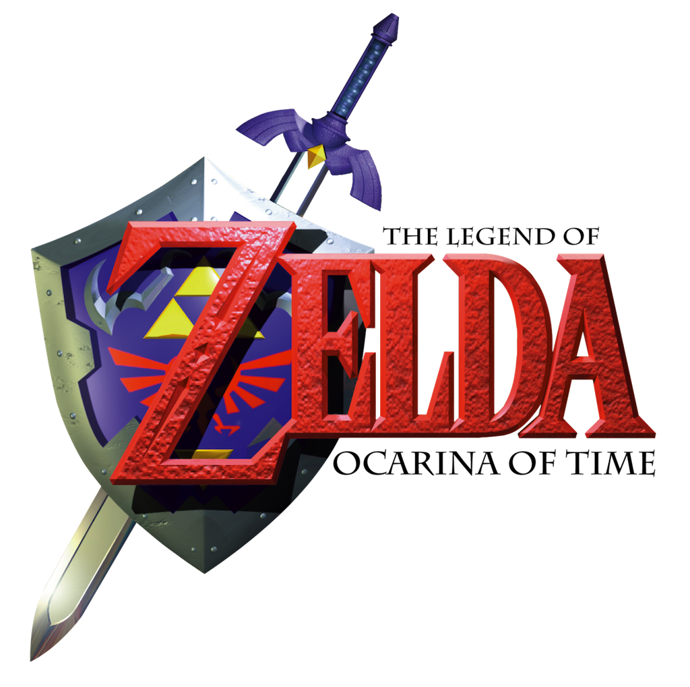

# The Legend of Zelda: Ocarina of Time FAQ/Walkthrough

By <a href="https://gamefaqs.gamespot.com/community/MrShotgun">MrShotgun of GameFAQs</a> © Andrew Brown July 26th 2007

----

All guides by MrShotgun are submitted to GameFAQs first, and disseminated to other hosting websites as the author finds the time and desire to do so. To ensure that you are viewing the most recent version of any guide, please visit [www.gamefaqs.com](https://www.gamefaqs.com).

## Authors Pledge

When Richard Taylor of New Zealand's Weta Workshop undertook the monumental task of the production design for the Lord of the Rings films, he gave this speech to his employees. Recognizing the significance of this speech, I have adopted it as my own pledge to the quality of my guides. God, I'm a nerd.

!!! quote "Richard Taylor, Weta Workshop"
    _If you can't rise to the highest level of enthusiasm, passion, and professionalism, and grasp this task as if it is the most important thing that you have ever taken on in your life, you aren't worthy of the task. We have been blessed with this opportunity._

## Version Information

### v1.0
July 13th - September 11th, 2006

This guide didn't really take me two months to write. It was more like two weeks. I worked on it intermittently in this two month period, along with my Killer7 guide, finally sitting down and really hacking away at it around September 3rd.

This version of the guide is complete and contains the following chapters:

- Version Information
- Table of Contents
- Game Basics
- Walkthroughs and Sidequests
- Inventory, Songs, Upgrades and Quest Items
- Pieces of Heart
- Gold Skulltulas
- Miniboss and Boss Appendix
- Frequently Asked Questions
- Legal Jargon, Links, Contact Information and Special Thanks.

All chapters are "complete," though I may update them or add additional material as I feel it is necessary.

### v1.1
September 12th, 2006

- Added an Obtaining Epona subchapter.

### v1.2
September 29th, 2006

- Added a Minigame Appendix chapter.

### v1.3
November 13th, 2006

- Added the Author's Pledge to the beginning of the guide.
- Ran the guide through the Microsoft Works Spellchecker.

### v1.4
March 09th - March 14th, 2007

- All instances of the words "Steel Boots" have been corrected to "Iron Boots," the correct name.
- Clarified the 100 Gold Skulltula reward.
- Updated the Considerations at the start of each Walkthrough subchapter.
- All instances of "Naryu" changed to "Nayru," the correct spelling.
- Removed a bit of text which stated that Young Link's boomerang can pierce Stalfos defenses, when it can't. Clarified that it must be nighttime to get Gold Skulltula #97.
- Links updated to conform with GameFAQ's newest file update.
- Fixed a silly typo where I refer to the Ice Arrows as Silver Arrows.
- Fixed an error where I instruct players to use the Sun's Song, when the Song of Storms is actually needed.

### v1.5
July 26th, 2007

- Item Checklists added to the start of each chapter in the Walkthrough. Status reports updated to look nicer.
